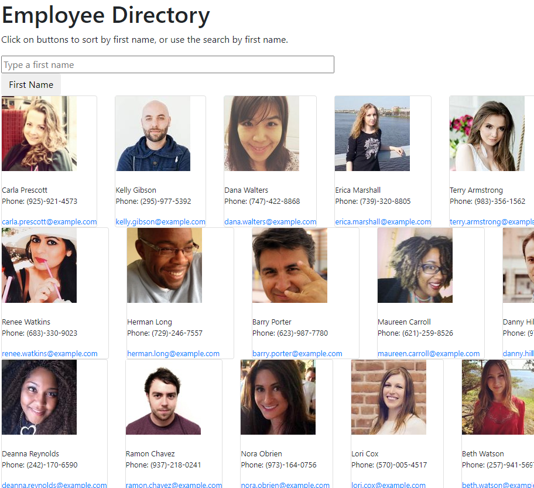

# 19_employee-directory

## Project Description
For this assignment, we are tasked with creating an employee directory with React. This assignment required that the application's UI be broken out into components, manage component state, and respond to user events.

## Acceptance Criteria
GIVEN a table of random users, when the user loads the page, a table of employees should render.
THEN the user should be able to:
* Sort the table by at least one category
* Filter the users by at least one property

## Experience
I know this is a broken record but this homework was HARD! 

## Issues
The app is deploying on my local machine and the filter/search and sort function works. However, I was not able to deploy to heroku. See images for filter/search and sort functions as deployed on local machine:

## Main Landing Page

## Filter/Search Field

## Sort by First Name

